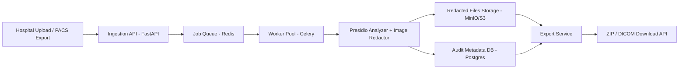
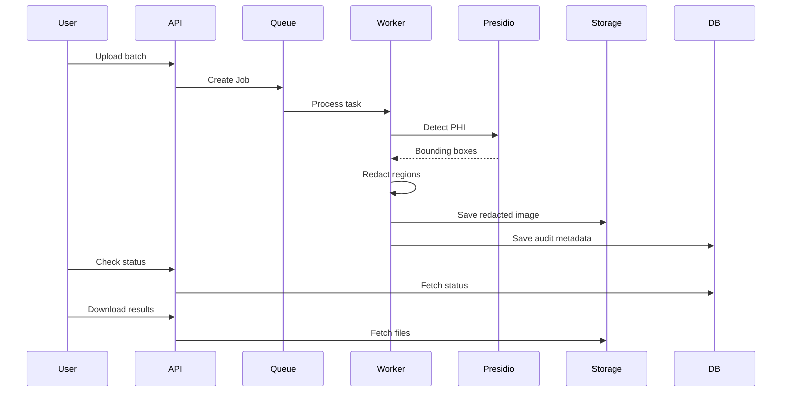
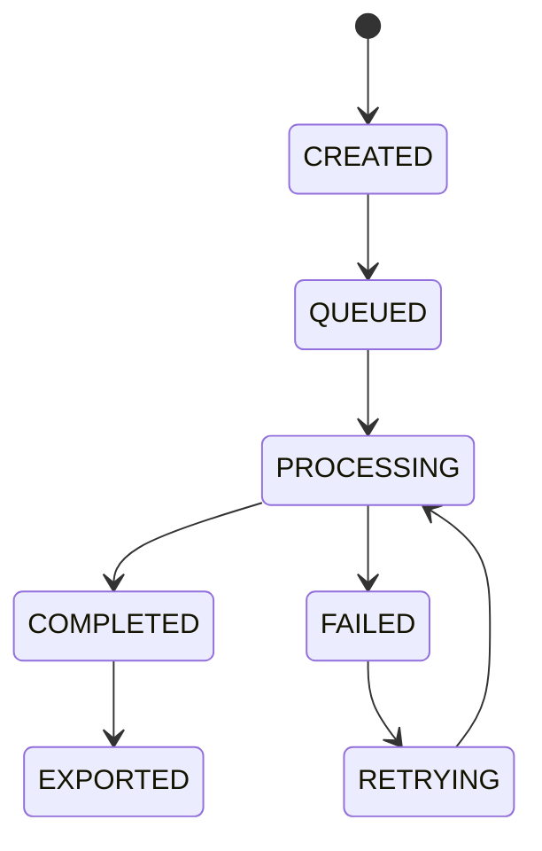

# GuardVision Medical — Architecture & Initial Issue Plan

## Overview
GuardVision Medical is an enterprise-grade medical image de‑identification pipeline designed for hospitals and regulated environments. The system ingests bulk medical images (including DICOM), detects Protected Health Information (PHI) using Microsoft Presidio, redacts sensitive data, and exports compliant datasets along with audit metadata.

---

## High Level Goals
- Deterministic PHI redaction (no LLM dependency)
- Bulk processing (hundreds to thousands of files)
- Auditable compliance logs
- On‑prem deployment capability
- Async background processing
- Secure export for research or sharing

---

## System Architecture



---

## Processing Pipeline



---

## Core Components

### 1. Ingestion Service (FastAPI)
Responsibilities:
- Accept single or batch uploads
- Validate file types
- Generate job ID
- Push tasks to queue

### 2. Job Queue (Redis)
- Handles asynchronous workloads
- Ensures retry capability
- Prevents API blocking

### 3. Worker (Celery)
Pipeline:
1. Presidio image analyzer (includes OCR internally)
2. Entity detection & bounding boxes
3. Region masking / redaction
4. Metadata creation

### 4. Redaction Engine (Presidio)
- Analyzer: detect PHI entities
- Image Redactor: mask regions
- Deterministic results

### 5. Storage (MinIO / S3)
Stores:
- Redacted images
- Temporary processing artifacts

### 6. Audit Metadata (PostgreSQL)
Stores:
- Entities removed
- Timestamp
- Confidence
- Processing duration

### 7. Export Service
Outputs:
- ZIP archive
- Folder structure
- Dataset package

---

## Job Lifecycle



---

## Data Contract Example

### Submit Job
POST /jobs

Response:
```json
{
  "job_id": "a8f2-9c21",
  "status": "queued"
}
```

### Job Status
GET /jobs/{id}

```json
{
  "status": "processing",
  "progress": 45
}
```

### Audit Metadata
```json
{
  "entities_removed": {
    "PERSON": 3,
    "DATE": 2,
    "MEDICAL_RECORD_NUMBER": 1
  },
  "processing_time": "1.8s"
}
```

---

## Initial GitHub Issues (Phase 1)

### Foundation
1. Setup FastAPI project skeleton
2. Add Docker & docker-compose for local stack
3. Configure Redis queue
4. Add Celery worker service
5. Health check endpoint

### Upload & Jobs
6. Create job creation endpoint
7. Implement batch file upload handling
8. Store job metadata in DB
9. Job status API

### Processing
10. Integrate Microsoft Presidio analyzer
11. Implement image redaction logic
12. Support DICOM image parsing
13. Generate audit metadata JSON
14. Retry failed processing jobs

### Storage & Export
15. Setup MinIO storage integration
16. Store redacted files securely
17. ZIP export endpoint
18. Download results API

### Compliance
19. No‑data‑retention processing mode
20. Hash patient identifiers
21. Add processing audit logs
22. Configurable PHI categories

### Dev Experience
23. Add sample dataset for testing
24. Unit tests for redaction pipeline
25. End‑to‑end job test

---

## Future Phases (Not in Phase 1)
- Authentication & RBAC
- Hospital tenant separation
- UI dashboard
- PACS integration
- Research dataset packaging
- Model plug‑in architecture

---

## Summary
GuardVision Medical transitions the project from a frontend AI tool into a compliant medical data processing pipeline capable of handling bulk sensitive healthcare data with deterministic redaction and auditability.

